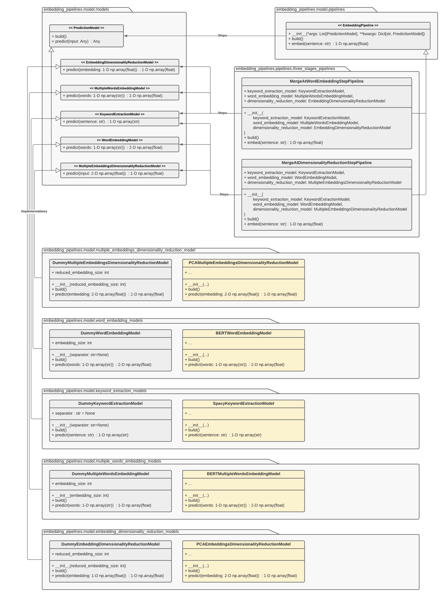

# rg_text_to_sound
**Research Group - Text to Sound**  
  
This README has two sections:
* Main Resources: the "primary"/"most used" resouces, with an in-depth explanation
* Other Resources: the resources that are implemented in this repository but are secondary, with a brief description and links to more in-depth READMEs


# Main Resources
## Embeddings Pipelines
Currently located at: [playground/mirco_nani/embeddings_pipelines/](playground/mirco_nani/embeddings_pipelines/)  
This repository defines the skeleton of the pipelines used at inference time, a simple design of the pipeline can be found [here](https://docs.google.com/presentation/d/1Cx96uZUxc3dx-PRyFl2v2R7lmjZ05UeixxwqPsBeEBQ/edit#slide=id.gbf06894dcc_0_30).  
All the pipelines take a sentence as input and output an embedding.

### Logical entities
Two simple logical entities are defined
* **EmbeddingPipeline**: an object that is able to take a sentence as input and to output an embedding.  
every pipeline is made of a series of steps.  
every step is a PredictionModel  
the pipeline uses PredictionModels connecting their I/O in order to get the final embedding
* **PredictionModel**: a class that contains a model which performs the internal operations of one step of a pipeline

### How to use
First, choose which pipeline you want to use from the [available pipelines](playground/mirco_nani/embeddings_pipelines/src/embeddings_pipelines/pipelines)
```python
from embeddings_pipelines.pipelines.three_stages_pipelines import MergeAtDimensionalityReductionStepPipeline
```

Check the signature and the docstring to see which are the compatible models for the steps of [this pipeline](playground/mirco_nani/embeddings_pipelines/src/embeddings_pipelines/pipelines/three_stages_pipeline.py)
```python
...
class MergeAtDimensionalityReductionStepPipeline(EmbeddingPipeline):
    """This pipeline contains the following steps:
    
     - keyword extraction: text sentence to sequence of N words
     - word embedding: sequence of N words to batch of N highly-dimensional embeddings
     - dimensionality reduction: batch of N highly-dimensional embeddings to single low-dimensional embedding

    """
    def __init__(
        self, 
        keyword_extraction_model: KeywordExtractionModel,
        word_embedding_model: WordEmbeddingModel,
        dimensionality_reduction_model: MultipleEmbeddingsDimensionalityReductionModel
    ):
...
```

Select and instantiate the pipeline steps from [models](playground/mirco_nani/embeddings_pipelines/src/embeddings_pipelines/models/) that extend the step's classes indicated by the signature and use them to instantiate the pipeline
```python
from embeddings_pipelines.models.keyword_extraction_model import DummyKeywordExtractionModel
from embeddings_pipelines.models.word_embedding_models import DummyWordEmbeddingModel
from embeddings_pipelines.models.multiple_embeddings_dimensionality_reduction_model import DummyMultipleEmbeddingsDimensionalityReductionModel

step1 = DummyKeywordExtractionModel(separator = " ")
step2 = DummyWordEmbeddingModel(embedding_size = 256)
step3 = DummyMultipleEmbeddingsDimensionalityReductionModel(reduced_embedding_size=16)
    
pipeline = MergeAtDimensionalityReductionStepPipeline(
    keyword_extraction_model = step1,
    word_embedding_model = step2,
    dimensionality_reduction_model = step3
)
```
Build the pipeline and use it on input sentences
```python
pipeline.build()
sentence1 = "this is a sentence"
sentence2 = "this is another sentence, longer than the first one"
emb1 = pipeline.embed(sentence1)
emb2 = pipeline.embed(sentence2)
print(f""" "{sentence1}" -> {emb1} """)
print(f""" "{sentence2}" -> {emb2} """)
```

### code structure
* embeddings_pipelines.model: contains the abstract classes definition
    + embeddings_pipelines.model.pipelines: contains abstract classes that define the pipelines
    + embeddings_pipelines.model.models: contains abstract classes that define the pipelines steps, AKA the models
* embeddings_pipelines.pipelines: contains the concrete implementations of the pipelines
* embeddings_pipelines.models: contains the concrete implementations of the models, every module contains models that implement a specific abstract class definition

## how to extend
### defining new pipelines
In order to define a new pipeline, create a new class inside the **embeddings_pipelines.pipelines** package.  
This class needs to extend [embeddings_pipelines.model.pipelines.EmbeddingPipeline](playground/mirco_nani/embeddings_pipelines/src/embeddings_pipelines/model/pipelines.py) and needs to implement its abstract methods complying with their signatures.  
Implementation examples can be found [here](playground/mirco_nani/embeddings_pipelines/src/embeddings_pipelines/pipelines/three_stages_pipelines.py).  
  
If the pipeline needs models that are not already defined, new model definitions can be added in the **embeddings_pipelines.model.models** module
### defining new models
In order to define a new model, create a new class inside the **embeddings_pipelines.models** package in the module (.py file) that has the same name of the implemented abstract class definition (create the module if it does not exist).  
This class needs to extend a model definition found in the **embeddings_pipelines.model.models** module and implement its abstract methods while complying with their signatures.  
Here are some implementation examples:
* [DummyKeywordExtractionModel](playground/mirco_nani/embeddings_pipelines/src/embeddings_pipelines/models/keyword_extraction_models.py)
* [DummyWordEmbeddingModel](playground/mirco_nani/embeddings_pipelines/src/embeddings_pipelines/models/word_embedding_models.py)
* [DummyMultipleWordsEmbeddingModel](playground/mirco_nani/embeddings_pipelines/src/embeddings_pipelines/models/multiple_words_embedding_models.py)
* [DummyEmbeddingDimensionalityReductionModel](playground/mirco_nani/embeddings_pipelines/src/embeddings_pipelines/models/multiple_embeddings_dimensionality_reduction_model.py)
* [DummyMultipleEmbeddingsDimensionalityReductionModel](playground/mirco_nani/embeddings_pipelines/src/embeddings_pipelines/models/multiple_embeddings_dimensionality_reduction_model.py)


### usage example
A very simple usage example can be found [here](playground/mirco_nani/embeddings_pipelines/src/embeddings_pipelines/embeddings_pipelines_sample_usage.py). 

### UML of the classes
NOTE: 
* you can edit the UML [here](https://lucid.app/lucidchart/invitations/accept/10b794c9-037d-4437-ac1a-96103aaf9037). Once edited, save it on the online tool, export it as PNG and replace the [assets/uml.png](playground/mirco_nani/embeddings_pipelines/assets/uml.png) file
* yellow classes are not yet implemented, they are represented for demonstration purposes  
  



# Other resources
## Git Tutorial
Currently located at: [playground/beat_toedtli/](playground/beat_toedtli/)  
A simple guideline on the structure and usage of this repository.
More details can be found in its own [README.md](playground/beat_toedtli/README.md)  

## words embeddings
Currently located at: [playground/beat_toedtli/word_embeddings](playground/beat_toedtli/word_embeddings)  
Word embeddings explorative implementations, benchmarked with [benchmarking_tools](playground/mirco_nani/embeddings_pipelines/benchmarking_tools)
More details can be found in its own [README.md](playground/beat_toedtli/word_embeddings/README.md)  

## Command Patterns Dataset
Currently located at: [playground/mirco_nani/embeddings_pipelines/commands_patterns_dataset](playground/mirco_nani/embeddings_pipelines/commands_patterns_dataset)  
A simple sentences generator to augment our dataset. It takes sentence patterns with blank tokens and replaces these tokens with given keywords. The final output consists of all the possible sentences obtainable from all the combinations of patterns and keywords.  
More details can be found in its own [README.md](playground/mirco_nani/embeddings_pipelines/commands_patterns_dataset/README.md)  

## Benchmarking Tools
Currently located at: [playground/mirco_nani/embeddings_pipelines/benchmarking_tools](playground/mirco_nani/embeddings_pipelines/benchmarking_tools)  
These tools are made to benchmark embedding models (such as BERT or sent2vec) in order to produce performances comparisons.
More details can be found in its own [README.md](playground/mirco_nani/embeddings_pipelines/benchmarking_tools/README.md)  
